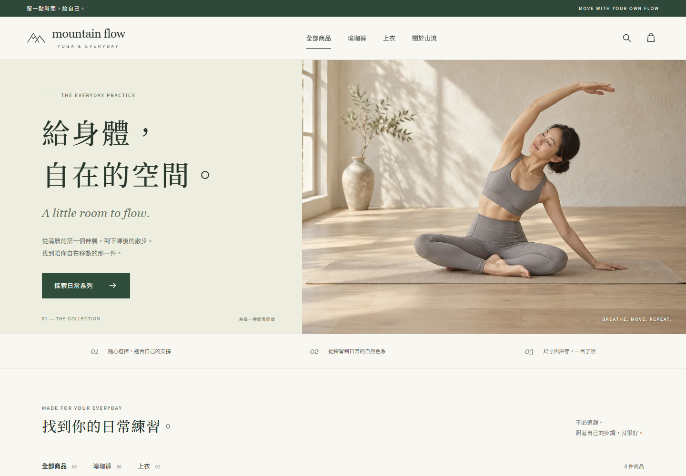

# Mountain Flow Yoga — 一間有兩個門的店

Built by **[DustyNoteAI](https://github.com/dustynotesai)** · [MIT License](LICENSE)

一個能實際操作的 agent commerce 示範專案：同一份商品目錄，一邊是人類逛的瑜珈服店，一邊是 AI agent 使用的 JSON／MCP 結帳介面。



## 店面更新

- 八件商品各有獨立生成的商品圖片，另有首頁情境圖；WebP 原尺寸與縮圖存放在 `public/images/`。
- 圖片依原目錄的顏色、口袋與剪裁產生，完整提示詞與修正紀錄見 [`docs/product-image-prompts.md`](docs/product-image-prompts.md)。圖片為虛構商品示意。
- 人類店面支援名稱／顏色搜尋、現貨尺寸、價格上限、口袋篩選與排序。原本的商品資料及 agent 授權機制維持共用。
- 單件購物袋透過 HttpOnly cookie 保留選擇四小時；重新啟動伺服器會清除記憶體中的購物袋與 session。
- 測試結帳使用 `4242 4242 4242 4242`、到期 `12/28`、CVC `123`。請使用虛構收件資料。重複送出已完成的訂單不會再次扣庫存。
- `npm test` 驗證篩選條件、庫存選項、商品資訊與所有圖片檔案。

這是一間**虛構的瑜珈服測試商店**，由 **DustyNoteAI** 為一支影片打造：
**如果網站以後不是做給人看的，那要做給誰看、怎麼做？**

同一份商品資料，開了兩個門：

| | 人類門 `/` | agent 門 `/agent` |
|---|---|---|
| 給誰 | 人 | AI agent（Claude Code 之類） |
| 長什麼樣 | 首頁、Hero、卡片、評價、動畫、表單 | JSON：`GET /products`、五個結帳 endpoint（OpenAI ACP 的形狀）、或一支 MCP server |
| 進門要什麼 | 什麼都不用 | **四道門**：身分（簽章）、授權（你簽的紙）、預算（上限）、付款（測試卡） |
| 同一個網址 | `Accept: text/html` 回 HTML | `Accept: text/markdown` 回 markdown（Cloudflare Markdown for Agents 的做法），header 帶兩個 token 數 |

商品跟評價都是編的。付款預設是模擬，給 `STRIPE_SECRET_KEY`（sk_test）就走 Stripe 測試模式，一樣不會扣真的錢。

## 三個指令就開店

需要 Node.js 20 以上版本。先下載或 clone 本專案，再進入專案資料夾執行：

```bash
git clone https://github.com/dustynotesai/yoga-agent-store.git
cd yoga-agent-store
npm install
npm run keygen                                   # 產生你跟 agent 的鑰匙，公鑰登記進店
npm run mandate -- --max 1200 --category yoga-pants   # 簽一張授權書：只能買瑜珈褲、上限 1200
npm start                                        # http://localhost:4242
```

只想瀏覽店面，可直接 `npm install`、`npm start`。`keygen` 與 `mandate` 是 agent 介面所需的設定。

`npm run keygen` 會在本機產生 `keys/` 與 `config/agents.json`；這些檔案不會提交到 Git。空白登記範例在 `config/agents.example.json`。

另開一個視窗：

```bash
npm run agent      # 看 agent 怎麼蓋章敲後門、四道門一道一道過
npm run tokens     # B1：同一間店，HTML／markdown／JSON 各多少 token
```

## 四道門是什麼

| 門 | agent 要帶 | 店要驗 | 你要簽 | 外面誰在推 |
|---|---|---|---|---|
| 1 身分 | 每個請求帶 Ed25519 簽章（`Signature-Input` / `Signature` / `Content-Digest`） | 用 `keyid` 到 `config/agents.json` 拿公鑰驗章 | `npm run keygen` | Visa Trusted Agent Protocol、Cloudflare Web Bot Auth（RFC 9421） |
| 2 授權 | 一張你簽的 mandate：給哪個 agent、能買哪一類 | mandate 簽名、agent 對不對、類別對不對 | `npm run mandate` | Google AP2 的 Mandate、Mastercard Verifiable Intent |
| 3 預算 | mandate 裡的 `max_amount` | 結帳金額 ≤ 上限 | 同上 | 同上 |
| 4 付款 | 一次性卡 token | 走 `…/complete` 扣款 | 綁卡 | Alchemy AgentCard ＋ Mastercard Agent Pay、Stripe 的 shared payment token |

每一道都可以單獨關掉，看少了它會發生什麼：

```bash
npm run gates                    # 看現在的設定
npm run gates -- budget off      # 關掉預算門
npm run gates -- all on          # 全開
```

被擋的時候回應會說是哪一道：`{"error":"over_budget","hint":"金額 1490 超過授權上限 1200","door":"budget"}`。

## 讓 Claude Code 走進來

repo 裡的 `.mcp.json` 已經登記了兩個 MCP：`yoga-store`（agent 門）跟 `playwright`（拿來走人類門）。
在這個資料夾開 Claude Code，它就看得到 `list_products`、`get_product`、`create_checkout`、`complete_checkout`、`cancel_checkout` 五個工具。
蓋章跟附授權書都在 `src/client.js` 裡做掉了，Claude Code 完全不用碰鑰匙。

同一個任務兩個門各走一次：

> 幫我買一件 M 號、有口袋、預算 1,200 以內、評價最高的瑜珈褲，寄到台北。

- 人類門：「用 playwright 打開 http://localhost:4242 …」
- agent 門：「用 yoga-store 的工具 …」

## 實驗

完整的實驗設計在 [`experiments/PROTOCOL.md`](experiments/PROTOCOL.md)。B3／B4（換順序、加標籤，各跑 N 次）有現成的跑法：

```bash
npm run experiment -- --runs 10 --orders original,reversed,random
```

每一次都是真的開一個 `claude -p` 走 MCP 後門，結果在 `experiments/runs/` 跟 `logs/orders.jsonl`。

## 檔案

```
data/products.json        八件商品（6 條瑜珈褲 ＋ 2 件上衣），sponsored / platform_pick 可以自己改
config/gates.json         四道門的開關、目錄順序、實驗標籤
config/agents.example.json 空白登記範例
config/agents.json        本機產生的公鑰登記（gitignored）
keys/                     私鑰跟授權書（gitignored）
logs/requests.jsonl       每一個請求：哪個門、幾 byte、幾 token
logs/orders.jsonl         每一筆訂單：哪個門、哪一輪實驗、選了哪件
src/server.js             兩個門
src/mcp.js                agent 門的 MCP 版
src/auth.js               簽章（身分）
src/mandate.js            授權書（授權＋預算）
src/payment.js            付款（模擬／Stripe 測試）
src/views.js              人類門的 HTML 跟 markdown
```

token 數是用 OpenAI 的 tokenizer（gpt-tokenizer）估的，Claude 的實際用量以 Claude Code 跑完的 usage 為準。

## 授權與作者

由 **[DustyNoteAI](https://github.com/dustynotesai)**（Dustin Lin）製作，以 [MIT License](LICENSE) 開源。歡迎 fork、修改與用來學習；使用或散布時請保留 LICENSE 中的版權與授權聲明。

商品圖片使用 AI 生成，提示詞保留於 [`docs/product-image-prompts.md`](docs/product-image-prompts.md)。這是一個供本機學習與實驗的示範專案，不是正式收款或出貨的電商系統。
